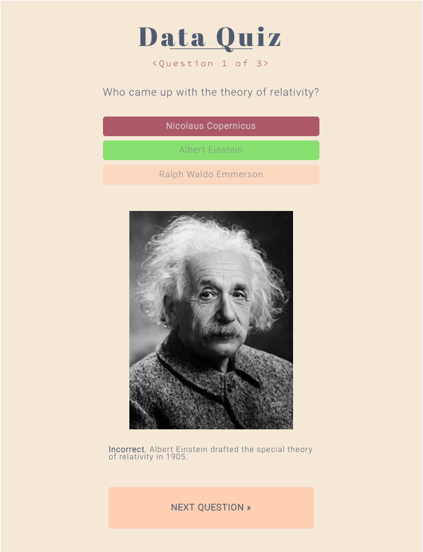
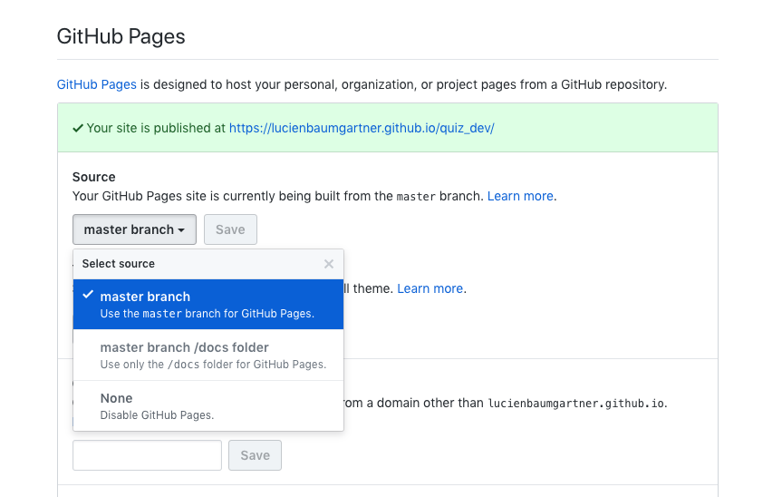

## Quiz app for the DDJ18 course at UZH

<p align="center"></p>

following things still need to be done:

- [x] write proper style sheet (sass) // used FT color scheme
- [x] check sass - css conversion
- [x] write 101 for students
- [x] check iframe implementability
- [x] fix bugs

## 101

### How I can I do my own quiz using the app?

The easiest is the following:

1. create a Github account
2. fork this repository
3. clone the repo (you maybe need to download Xcode first (app store), and aggree to the licence agreement)

```
[[terminal]]
cd ../where/you/want/the/project/folder
git clone https://github.com/<your_username>/quiz_dev
```
4. enable Github Pages on your master branch; go to your repo in the browser, click on the `setup` button (top right, little cog symbol), scroll down to the Github Pages chunk and choose the following option:

<p align="center"></p>

Your quiz will be publicly available @ https://<your username>.github.io/quiz_dev/ in a few minutes.

5. to add your own content, just edit the following lines in the `script.js` (you can open that with any code editor, also RStudio) to include your custom data (make sure that your DO NOT change the variable names in the array!), and save the changes:

```
[[script.js]]
var quiz = [
       {
           "question" : "Q1: Who came up with the theory of relativity?",
           "image" : "http://upload.wikimedia.org/wikipedia/commons/thumb/d/d3/Albert_Einstein_Head.jpg/220px-Albert_Einstein_Head.jpg",
           "choices" : [
                                   "Nicolaus Copernicus",
                                   "Albert Einstein",
                                   "Ralph Waldo Emmerson"
                               ],
           "correct" : "Albert Einstein",
           "explanation" : "Albert Einstein drafted the special theory of relativity in 1905.",
           "graphics" : ''
       },
       {
         ....
        },
   ];
```

6. upload changes to GitHub (note that `git branch` is only needed if you work on several branches, otherwise `master` will be default; in case you work on another branch, push the change as follows: `git push -u origin <branch name>`):

```
[[terminal]]
cd quiz_dev
git branch
git add .
git commit -m 'some name for your changes'
git push -u origin master
```

### Develop local first

If you had to commit and push all changes to github to display them in order to see if everything works as desired, the whole development process would be super cumbersome. Instead, you can compile your app locally in your webbrowser, using Python (you can also do it differently, just google):

```
[[terminal]]
cd quiz_dev
python -m SimpleHTTPServer
```

This will allow you to acces the app at `localhost:8000` in your browser. If you save any changes, just refresh your browser session (cmd+R) and the will be compiled instantly (for changes in `script.js` you might have to close the localhost-page in your browser and reopen it; depending on how busy it is).
Once your are satisfied with the changes, just commit them to your Git.

### A note on including graphics in your explanation box

If you want to include graphics as part of your explanation to an answer, you need to include the whole HTML/CSS-specification of the picture to control its aestethics:

```
[[script.js]]
...

"graphics" : ''
...
```

Note that you can specify properties of the class of the image in your sass file, as follows:

```
[[stylesheet.sass]]||[[stylesheet.css]]
...

.custom_class {
    display: block;
    margin-left: auto;
    margin-right: auto;
    width: 70%;
    margin-bottom: 30px;
}
...
```


### Deploy the app on your website

To deploy the app on your website or your blog entry you just need to include it within an iframe-element:

```
<iframe src="https://<your username>.github.io/quiz_dev/" width="200" height="200"></iframe>
```

### Working with sass-stylesheets instead of normal css

The app is enables the use of sass (syntactically awesome style sheets - aka css on steroids). If you are familiar with the format, you have to set up a ruby sass-css converter. To do so, run the following commands in your terminal to install ruby via homebrew (you might also need to install homebrew) as well as the sass gem:

```
$ brew install ruby
$ gem install sass
```

Now you can tell ruby to watch your either a folder with all your sass files in order to convert them to the output path (your css folder), or just single files. In this case We just listen to the whole folder:

```
$ cd quiz_dev
$ sass --watch sass:css
```

Now all the changes done to any files in `/sass` are automatically converted to updated in the `/css` folder.

See [here](http://sass-lang.com/documentation/file.SASS_REFERENCE.html#using_sass) for a full documentation on sass
